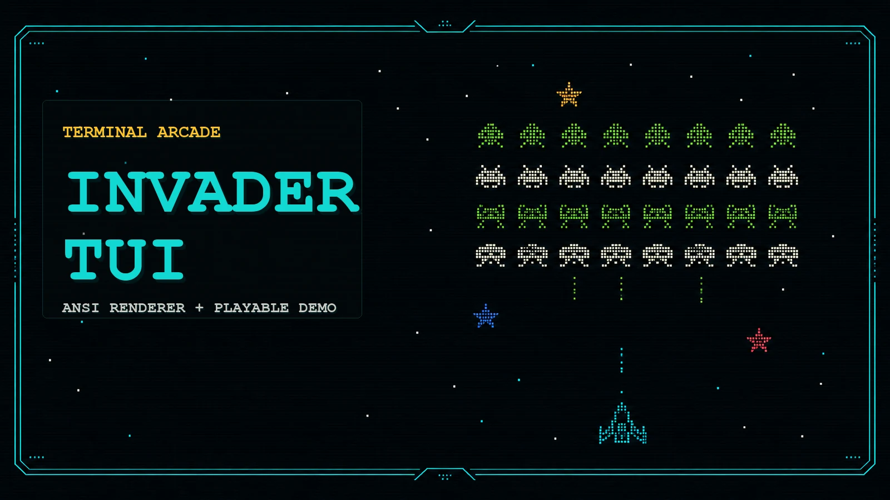

<p align="center">
  
</p>

# Invader TUI

**Invader TUI** is a retro arcade terminal project built around typed sprite assets, reusable TUI widgets, and a playable space-invasion demo. It combines a kitchen-sink renderer for validating the visual system with a live terminal game loop that uses the same component layer.

The project is intentionally terminal-native: no browser canvas, no external game engine, no UI framework. Just TypeScript, ANSI rendering, sprite catalogs, and a lot of arcade pressure.

## Highlights

- **Playable terminal demo** with splash screen, Classic/Turbo mode choice, ship builder, waves, bosses, powerups, upgrades, victory, and game-over flows.
- **Reusable TUI components** for boxes, HUDs, counters, bars, diagnostics, borders, and kitchen-sink previews.
- **Typed asset catalogs** for enemy species, player ships, ship designs, modules, paint schemes, sprite variants, roles, stats, and animation frames.
- **Deterministic snapshot renderer** for testing layouts at fixed terminal sizes.
- **Terminal-safe rendering** with alternate-screen mode, mouse escape filtering, viewport fallback, and clean TTY shutdown.

## Quick Start

```sh
pnpm install
pnpm demo
```

The playable demo requires an interactive TTY. If the terminal is too small, the demo shows a compact fallback instead of overflowing into scrollback.

## Commands

```sh
pnpm demo
pnpm start
pnpm snapshot -- --cols 100 --rows 30
pnpm snapshot -- --cols 100 --rows 30 --focus ships --bg stars --border arcade --color
pnpm snapshot -- --cols 120 --rows 36 --focus designs
pnpm test
pnpm check
```

| Command | Purpose |
| --- | --- |
| `pnpm demo` | Runs the playable arcade demo. |
| `pnpm start` | Runs the animated kitchen-sink preview loop. |
| `pnpm snapshot` | Renders one deterministic kitchen-sink frame. |
| `pnpm test` | Runs the Vitest suite. |
| `pnpm check` | Runs TypeScript without emitting files. |

## Demo Controls

| Screen | Controls |
| --- | --- |
| Splash | `Enter` / `Space` to continue, `Q` to quit |
| Mode select | `A/D` or arrow keys to choose Classic/Turbo, `Enter` / `Space` to continue |
| Ship select | `Space` or `Tab` to customize the highlighted P1/COM ship, `A/D` or left/right to choose ship, `Enter` to launch as-is, `C` to toggle 1P/2P COM, `E` to edit P1/COM, `R` to reset the highlighted ship |
| Ship customize | `W/S` or up/down to choose Color, Nose, Left, Right, Tail, Inside, Gun, Wing, Engine, Core, Defense, Support, or Name; `A/D` or left/right changes the selected row, `Space` returns to selection, `Enter` launches, `N` cycles presets, `R` restores stock |
| Gameplay | `A/D` or left/right arrows to move, `Space` to shoot, COM-02 auto-pilots in 2P COM mode, `Q` to abort |
| Turbo gameplay | Adds `W` toward the gate, `S` away from the gate, `Shift+A/D` or Shift+left/right to rotate through four headings, `E` for engine thrust, `X` for the charged special weapon, a route mini-map, soft camera follow near screen edges, roaming v2 enemies, loot caches, and slow rotating side asteroids |
| Result | `R` to restart, `Q` to quit |

Victory restarts preserve score and advance the campaign loop. Each loop makes enemies tougher, faster, and more dangerous.

## Gameplay Notes

- White stars are collectible upgrade currency.
- Larger colorful stars grant bigger upgrade value.
- Shield pickups temporarily bring the shield online.
- Cloak pickups briefly break enemy targeting and let enemy fire pass through the player, while physical hazards still collide.
- Ship customization keeps the animated ship selection first in Classic and Turbo; launch stock ships as-is or enter the builder for shape, paint, weapon, wing, engine, core, defense, support, and callsign changes.
- Shape parts and modules change hull, shield, speed, turn rate, damage, fire rate, spread, and star affinity before launch, with the builder showing deltas against the stock chassis.
- Ship upgrades preserve the current design while moving the selected chassis through stronger level variants.
- 2P COM mode adds a computer-controlled wingmate that shoots, dodges, collects pickups, and can be destroyed independently.
- Classic mode preserves the original horizontal-lane play space.
- Turbo mode is a v2 adventure run: the arena fills the terminal, the ship rotates through four clear headings (`GATE`, `EAST`, `AWAY`, `WEST`), the route mini-map shows gate distance and east/west drift, `W` moves toward the gate, `S` can fall back away from it, `E` burns the engine along the current heading, the viewport follows near edges so the world scrolls around the ship, loot caches can be collected for upgrades and route recovery, reaching the final gate opens the boss fight, smarter enemies lead/intercept your heading, large slow gray asteroids rotate in from the sides, occasional threats arrive from behind, low-motion arcade rumble stays in the background, and a smaller charged Nova-style secondary weapon clears pressure.
- Boss waves add special enemy patterns and escort pressure.
- The HUD only shows shield state when shield mechanics are active.

## Project Layout

```text
src/
  assets/          Typed enemy, ship, design, module, and paint catalogs
  render/          Kitchen-sink renderer, widgets, sprite rendering
  sim/             Shared state types and deterministic state builder
  tui/             ANSI and layout primitives
  cli.ts           Kitchen-sink CLI entrypoint
  demo.ts          Playable arcade demo
```

## Renderer Model

The project keeps visual primitives small and composable:

- `src/tui/ansi.ts` handles ANSI color, width, truncation, and alignment.
- `src/tui/layout.ts` owns boxes, borders, stacking, dividers, and frame normalization.
- `src/render/widgets.ts` exposes reusable HUD, bar, counter, diagnostics, and catalog panels.
- `src/render/kitchenSink.ts` composes the component library into a broad visual test surface.
- `src/demo.ts` consumes the same primitives for the playable game.

That split keeps the demo from becoming a one-off rendering fork.

## Snapshot Examples

Render a compact frame:

```sh
pnpm snapshot -- --cols 80 --rows 24
```

Render a larger themed frame:

```sh
pnpm snapshot -- --cols 120 --rows 36 --focus enemies --bg crt --border arcade --color
```

Preview the ship builder surface:

```sh
pnpm snapshot -- --cols 120 --rows 36 --focus designs
```

## Development

Run the core validation before committing:

```sh
pnpm check
pnpm test
```

The tests cover asset catalog validity, width safety, kitchen-sink rendering, and compact HUD behavior.

## License

MIT. See [LICENSE](LICENSE).

## Status

This is an active local project. The current focus is turning the visual system and demo into a fuller terminal arcade experience while keeping the renderer reusable and testable.
